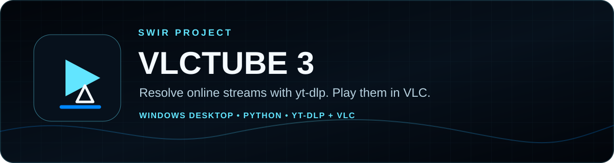
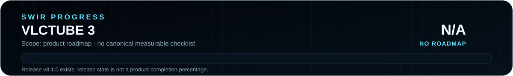

<!-- SWIR-README-STANDARD:v2 -->

<div align="center">



# VLCTube 3

**Resolve supported online media pages with yt-dlp, pass direct media URLs through, and launch playback in VLC.**

[](https://github.com/Swir/Youtube-VLC/actions/workflows/ci.yml)


[](https://github.com/Swir)
[](https://github.com/Swir/Youtube-VLC/releases/tag/v3.1.0)
[](https://github.com/Swir/Youtube-VLC/stargazers)

[**Highlights**](#-highlights) · [**Quick Start**](#-quick-start) · [**Playback**](#-how-playback-works) · [**Releases**](#-releases) · [**Safety**](#-privacy--responsible-use)

</div>

<p align="center"></p>

**Product roadmap progress:** N/A — the repository has releases, tests and a changelog, but no canonical product-completion checklist or weighted roadmap. Release `v3.1.0` is therefore not presented as a percentage of an undefined future scope.

## 📍 Project Status

| Item | Current state |
|---|---|
| Current release | [`v3.1.0`](https://github.com/Swir/Youtube-VLC/releases/tag/v3.1.0), published September 17, 2026 |
| Packaged platform | Windows x64 release assets; README requirements target Windows 10/11 |
| Source runtime | Python `>=3.10`; project CI covers Python 3.10–3.14 |
| Playback dependency | VLC Media Player installed locally |
| Resolver | `yt-dlp>=2026.8.19,<2027` in current project metadata |
| Product roadmap | Not present; completion percentage is intentionally N/A |

<p align="center"></p>

## 🚀 Overview

**VLCTube** is a desktop stream launcher. It validates HTTP/HTTPS input, passes clearly direct media URLs such as M3U8, MP4, WebM and common audio resources directly to VLC, and uses yt-dlp for supported page-based sources. It can queue URLs, expand public playlists, remember recent launches, select quality presets and attach a separate audio stream to VLC when a resolved format uses separate video/audio URLs.

VLCTube is **not a downloader**. The current application does not save media files, bypass DRM or provide access to content that the source service does not expose to the user.

## ✨ Highlights

| Feature | What it does |
|---|---|
| Stream resolving | Uses yt-dlp with a timeout and retry settings for page-based media sources. |
| Direct media passthrough | Sends recognized direct HTTP/HTTPS media resources straight to VLC without page extraction. |
| Quality presets | Best, 1080p, 720p, 480p, 360p and audio-only format selection. |
| Separate A/V handling | Sends a resolved video URL to VLC and uses `--input-slave` when a separate audio URL is present. |
| VLC queue behavior | Launches with one-instance / playlist-enqueue behavior so new items can join the existing VLC queue. |
| Queue + playlists | Adds multiple URLs and can expand supported public playlist entries into queue items. |
| VLC detection | Checks `VLCTUBE_VLC`, PATH, common Windows locations and VideoLAN registry entries; manual selection remains available. |
| Local history/settings | Stores quality, language, VLC path and up to 50 recent launched URLs in the user's app/config area. |
| Languages | English, Polish and Norwegian with system-language detection. |
| Diagnostics | Maintains a rotating local application log. |
| App identity | Existing `assets/vlctube_icon.svg` / `.png`, with a generated Windows ICO during packaging. |
| Safety boundaries | Accepts only HTTP/HTTPS URLs and rejects embedded URL credentials. |

## 🧭 v3.1 Regression Audit

VLCTube 3.1 was compared with the original 2024 launcher during its existing regression work. The simple paste/select-VLC/play workflow remains, while the modern queue, quality presets, playlist expansion, history and multilingual interface are retained.

Two classic behaviors are explicitly represented in the current source and tests:

- **VLC playlist enqueue:** launched media uses `--playlist-enqueue` rather than replacing the current VLC playlist by default.
- **Direct media URL passthrough:** URLs whose paths clearly identify supported media suffixes can bypass yt-dlp page extraction and go straight to VLC.

The current project CI builds the runtime icon and performs both non-GUI and Windows GUI startup smoke checks; release packaging performs additional packaged-EXE smoke checks before its publish step.

## ⚙️ Quick Start

### Recommended — Windows release

Download [`VLCTube v3.1.0`](https://github.com/Swir/Youtube-VLC/releases/tag/v3.1.0). The published release includes:

```text
VLCTube.exe
VLCTube.exe.sha256
VLCTube-v3.1.0-Windows-x64.zip
VLCTube-v3.1.0-Windows-x64.zip.sha256
```

VLC Media Player must still be installed locally for playback.

### From source

```bash
git clone https://github.com/Swir/Youtube-VLC.git
cd Youtube-VLC
python -m pip install -e ".[test]"
python run.py
```

Non-GUI self-test:

```bash
python -m vlctube --smoke-test
```

GUI startup smoke test:

```bash
python -m vlctube --smoke-gui
```

Run the test suite:

```bash
pytest
```

## 📋 Requirements / Compatibility

- Packaged release: Windows x64; project documentation targets Windows 10/11.
- Source: Python 3.10 or newer according to `pyproject.toml`; CI currently covers 3.10, 3.11, 3.12, 3.13 and 3.14.
- Tkinter and a graphical desktop session for the GUI.
- VLC Media Player installed locally.
- Internet access for online resolution/playback.
- `yt-dlp>=2026.8.19,<2027` in the current project metadata.

Source use on another desktop OS depends on that environment providing Python, Tkinter, VLC and the project dependency; no packaged non-Windows release is claimed here.

## ▶️ How Playback Works

1. VLCTube normalizes and validates the supplied HTTP/HTTPS URL.
2. If the URL path has a recognized direct-media suffix, it is passed through unchanged; otherwise yt-dlp resolves a playable stream at the selected quality.
3. A combined stream is sent to VLC as one URL.
4. When yt-dlp returns separate video and audio formats, the video is the primary input and the audio URL is attached using VLC's `--input-slave` option.
5. VLC is launched in one-instance/enqueue mode to preserve the queue-friendly classic behavior.

Direct stream URLs can expire. Page-based items are resolved again when launched so a fresh stream URL can be obtained from the source service.

## 🔌 VLC Detection

VLCTube checks the `VLCTUBE_VLC` environment variable, PATH, common Program Files/LocalAppData locations and standard VideoLAN registry entries on Windows. The GUI also permits manually choosing `vlc.exe`.

## 🧠 Technology / Project Layout

| Area | Current implementation |
|---|---|
| Packaging metadata | [`pyproject.toml`](pyproject.toml) with setuptools and a `vlctube` console entry point. |
| GUI/runtime | [`src/vlctube/app.py`](src/vlctube/app.py) and supporting modules. |
| Resolution | [`src/vlctube/resolver.py`](src/vlctube/resolver.py) with yt-dlp and direct-media passthrough. |
| VLC launch | [`src/vlctube/vlc.py`](src/vlctube/vlc.py). |
| Tests | [`tests/`](tests/) plus Linux Python matrix and Windows GUI smoke CI. |
| Release build | [`.github/workflows/release.yml`](.github/workflows/release.yml), PyInstaller, icon generation and packaged smoke tests. |
| README progress | `assets/readme/progress-*.svg` generated/checked by [`tools/generate_readme_progress.py`](tools/generate_readme_progress.py). |

The existing project icon remains the application/README identity; the new hero extends that identity into the shared SWIR documentation family rather than replacing it.

## 📦 Releases

- [**VLCTube v3.1.0 →**](https://github.com/Swir/Youtube-VLC/releases/tag/v3.1.0)
- [**All releases →**](https://github.com/Swir/Youtube-VLC/releases)
- [**Changelog →**](CHANGELOG.md)

The release workflow runs tests, builds the icon, starts the source GUI, builds the Windows EXE, smoke-tests the packaged executable and only then reaches the publish step. This README migration does not trigger or create a new release.

## 🔐 Privacy & Responsible Use

Preferences, history and logs are stored locally in the normal per-user application/configuration directory. VLCTube does not operate its own analytics service. URLs necessarily reach the relevant source service through yt-dlp and VLC when you resolve or play them.

Use VLCTube only for media you are permitted to access and play. Respect source-site terms, regional restrictions and content rights. The project intentionally does not include DRM circumvention, authentication bypass or automated bulk downloading. See [`SECURITY.md`](SECURITY.md) for the repository's security guidance.

## ⚠️ Limitations

- yt-dlp behavior depends on source websites and can change when those websites change.
- Direct or resolved stream URLs may expire.
- VLC is an external runtime requirement and must be installed/configured separately.
- Public playlist expansion is bounded by the resolver implementation; unsupported/private/authenticated sources may fail according to source access requirements.
- No canonical product roadmap exists, so software-completion progress remains **N/A**.
- No `LICENSE` file is present in the current repository; this migration does not assign a license.

## 🔎 Search Keywords

`VLC stream launcher` • `yt-dlp VLC player` • `Python VLC launcher` • `online video stream resolver` • `direct M3U8 VLC` • `Windows VLC utility` • `yt-dlp desktop GUI` • `VLC playlist enqueue` • `video quality selector` • `playlist stream launcher` • `Python Tkinter media app` • `multilingual VLC launcher` • `VLCTube by Swir` • `online media playback tool`

---

<div align="center">


### `RESOLVE • QUEUE • PLAY`

**VLCTube 3 — by Swir**

[**← SWIR profile**](https://github.com/Swir) · [**All projects →**](https://github.com/Swir?tab=repositories) · [**Report an issue**](https://github.com/Swir/Youtube-VLC/issues)

</div>
